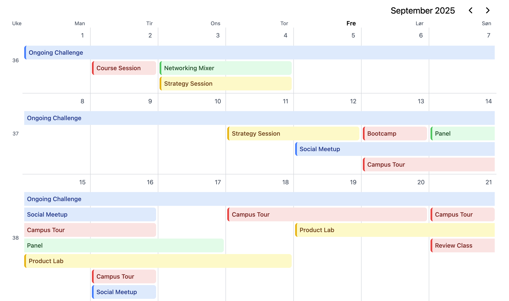

# React Event Calendar

A modern, responsive event calendar component built with React, TypeScript, and Tailwind. Features multi-day event support with smart layout computation, and customizable event categories.





## Getting started

### Installation

```bash
# Clone the repository
git clone https://github.com/johannes-aas/react-calendar.git
cd react-calendar

# Install dependencies
npm install
# or
pnpm install
# or
yarn install

# Start development server
npm run dev
# or
pnpm dev
# or
yarn dev
```

### Basic Usage

```tsx
import { EventCalendar } from './components/EventCalendar'
import { EventCalendarHeader } from './components/EventCalendarHeader'
import { useState } from 'react'

function App() {
  const [view, setView] = useState({ year: 2025, month: 0 })
  
  const events = [
    {
      id: '1',
      title: 'Team Meeting',
      start: new Date(2024, 0, 15, 10, 0),
      end: new Date(2024, 0, 15, 11, 0),
      type: 'course',
      locationName: 'Conference Room A'
    },
    // ... more events
  ]

  return (
    <div>
      <EventCalendarHeader
        year={view.year}
        month={view.month}
        onNavigate={(year, month) => setView({ year, month })}
      />
      <EventCalendar 
        year={view.year} 
        month={view.month} 
        events={events} 
      />
    </div>
  )
}
```

## Reference

### EventCalendar Props

| Prop | Type | Required | Description |
|------|------|----------|-------------|
| `year` | `number` | ✅ | The year to display |
| `month` | `number` | ✅ | The month to display (0-11) |
| `events` | `Event[]` | ✅ | Array of events to display |

### Event Interface

```tsx
interface Event {
  id: string
  title: string
  start: Date
  end: Date
  locationName?: string
  type?: EventCategoryKey
  link?: string
}
```

### EventCalendarHeader Props

| Prop | Type | Required | Description |
|------|------|----------|-------------|
| `year` | `number` | ✅ | Current year |
| `month` | `number` | ✅ | Current month (0-11) |
| `onNavigate` | `(year: number, month: number) => void` | ✅ | Navigation callback |

## Configure categories

Customize categories using tailwind:

```tsx
// src/config/eventCategories.ts

export const eventCategories = {
  social: {
    displayName: "Social",
    classes: {
      // The dot for the color guide at the bottom
      guide: "bg-blue-500 dark:bg-blue-600",

      // The item trigger
      item: "bg-blue-100 text-blue-900 border-blue-500 dark:bg-blue-950 dark:text-blue-300 dark:border-blue-600",

      // Gradient to fade out overflowing text, must match background of item 
      itemFade: "to-blue-100 dark:to-blue-950",

      // popover card
      card: "bg-blue-100 text-blue-950 border-blue-200 hover:border-blue-300 dark:bg-blue-950 dark:text-blue-50 dark:border-blue-900 dark:hover:border-blue-800",

      // category badge
      badge: "bg-blue-200 text-blue-700 dark:bg-blue-800 dark:text-blue-200",
  },
  // Add more categories...
}
```


## Development

### Project Structure

```
src/
├── components/
│   ├── EventCalendar.tsx
│   ├── EventCalendarHeader.tsx
│   └── EventCalendarItem.tsx
├── config/
│   └── eventCategories.ts
├── demo/
│   ├── Demo.tsx
│   ├── events.ts
│   └── icons/
├── types/
│   └── types.ts
└── utils/
    ├── computeCalendarLayout.ts  # layout magic
    └── utils.ts
```
